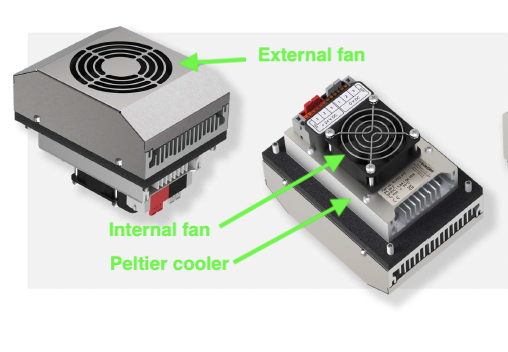
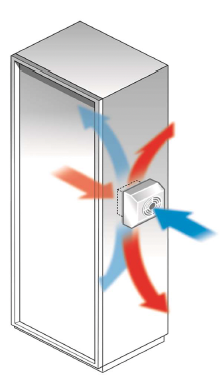

######################################################
Improving temperature control of the AuxTel WREB board
######################################################

.. abstract::

   Temperature control of the AuxTel WREB board was greatly improved by installing a script to control the cooling fan.  However, there are still temperature excursions when the ambient temperature is too hot or too cold.  We have purchased from ELMEKO a Peltier cooling module, which can also heat, to improve the situation.  This technote describes the situation and the plans for implementing the Peltier cooler. 

Introduction
================
The WREB board that controls the AuxTel CCD is mounted in a small enclosure on top of the cryostat, as shown in Figure 1.  As originally configured, there was no temperature control of the WREB board.  Figure 2 shows the temperature of the WREB board through the seasons before any temperature control was implemented.  The temperature was varying by more than 25C.  This caused problems with gain stability and bias stability.  To improve this somewhat, a script was written (and later added to the atspower CCS subsystem), that controlled the WREB temperature by turning on and off the ventilation fan for the WREB enclosure.  As ccurrently implemented, the fan is turned on when the WREB temperature reaches 29C, and is turned off when the temperature falls to 28C.  This has dramatically improved the temperature control, as seen in Figure 3.  However, in the summer when the ambient temperature is too high, or in the winter when the ambient temperature is too low, this scheme loses control of the WREB temperature, as shown in Figures 4 and 5.  This note outlines a scheme to eliminate those temperature excursions.

Figure 1.  Schematic showing the WREB board mounted on top of the cryostat.

Figure 2.  WREB temperatures before implementing fan control.  Temperatures can vary by more than 25C.

Figure 3.  WREB temperatures after implementing fan control.  Temperatures are within +/- 0.5C most of the time.

Figure 4.  An excursion where the ambient temperature in the dome is too hot and the fan loses control.

Figure 5.  An excursion where the ambient temperature in the dome is too cold and the fan loses control.

The ELMEKO thermoelectric cooler/heater
===========================================
A thermoelectric cooler/heater has been purchased from ELMEKO (https://www.elmeko.de/en/home), and this section briefly describes the unit. The users manual is in the documents directory of this technote at https://github.com/lsst-sitcom/sitcomtn-153.  Figure 6 shows photographs of the unit, and Figure 7 shows how the unit can be configured to cool the air inside an enclosure.  We have briefly tested the unit and verified that it does cool as intended.  The manual says that by reversing the polarity of the voltage across the Peltier thermoelectric module, then the module will heat.  However, this has not yet been tested.

Figure 6.  Photos of the ELMEKO thermoelectric heater/cooler.

Figure 7.  Using the ELMEKO unit to control the air temperature inside an enclosure.

Preliminary implementation plan
===========================================
Figure 8 shows the current status.  The fan on the left (which is under CCS software control), pushes air into the enclosure, and the air leaves through the fan in then center.  The fan module in the center was an earlier unsuccessful attempt to control the temperature, and it is currently disabled.
Figure 9 shows a photograph of the WREB enclosure, showing the metal cover that covers the WREB board.

Figure 10 show a proposal for implementing the ELMEKO unit.  This involves building a larger WREB enclosure to accomodate the ELMEKO unit.  Building a new enclosure cover has the advantage that we can swap the new unit in and remove it if problems are encountered.  Also, we should be able to use the same basic software control to cycle the ELMEKO on and off to control the temperature.  When winter comes, this will require an additional step to switch the ELMEKO to heater mode.  This software and hardware still needs to be developed. 

Figure 8.  Current status of the airflow in the enclosure.

Figure 9.  Photograph of the WREB enclosure.

Figure 10.  Proposed plan for implementing the ELMEKO unit.

Summary and status
===========================================
This is as far as things have gotten at this point.  I would appreciate feedback on the proposed plans
